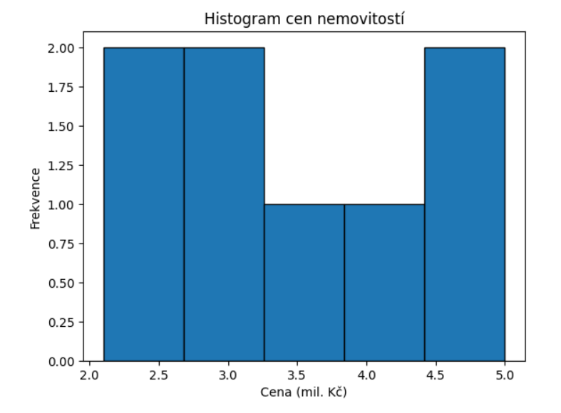
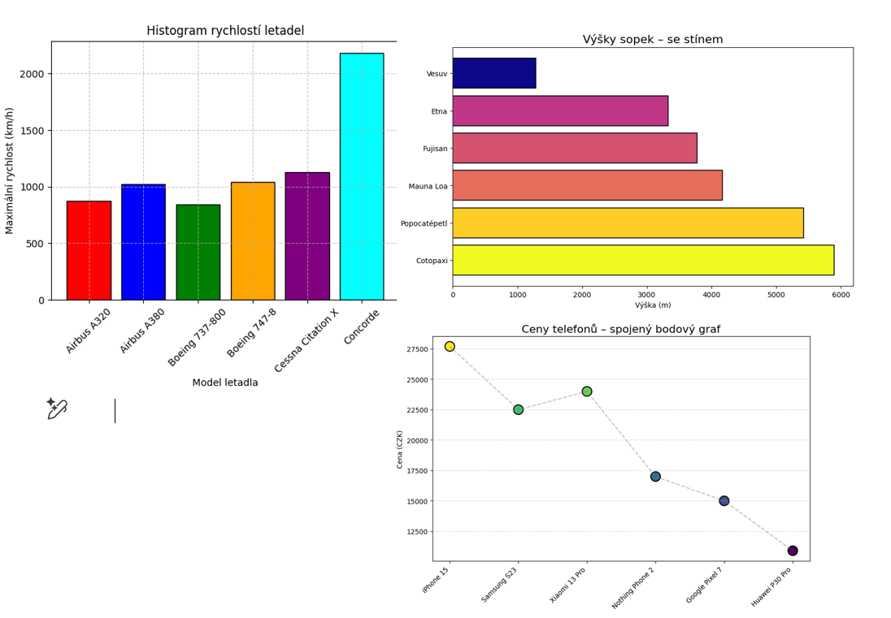
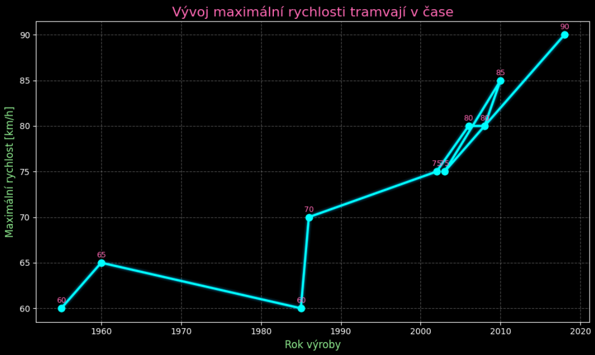
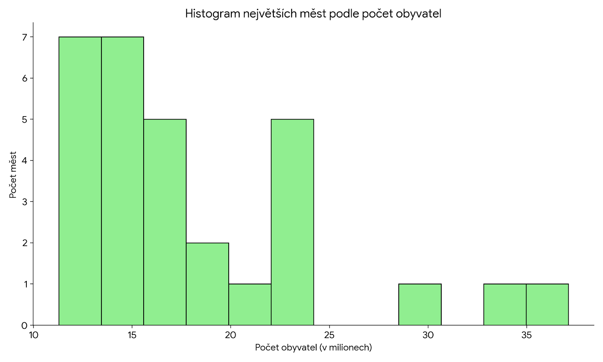
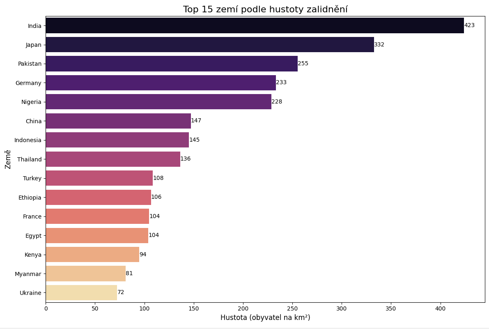
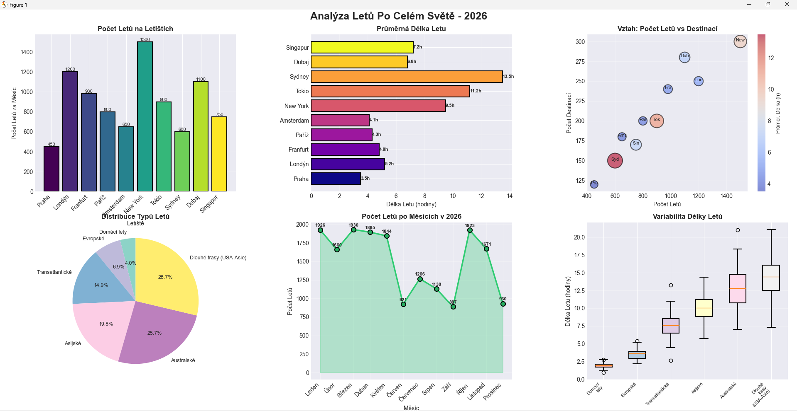
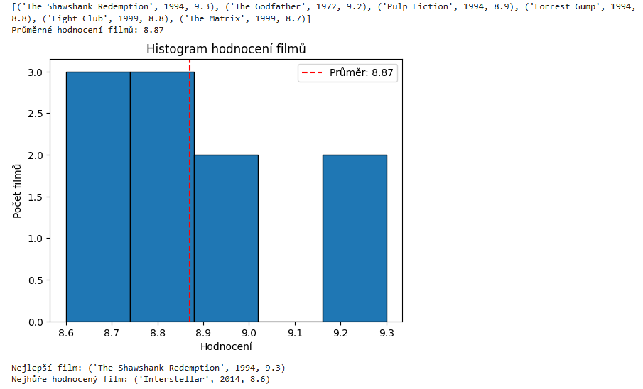
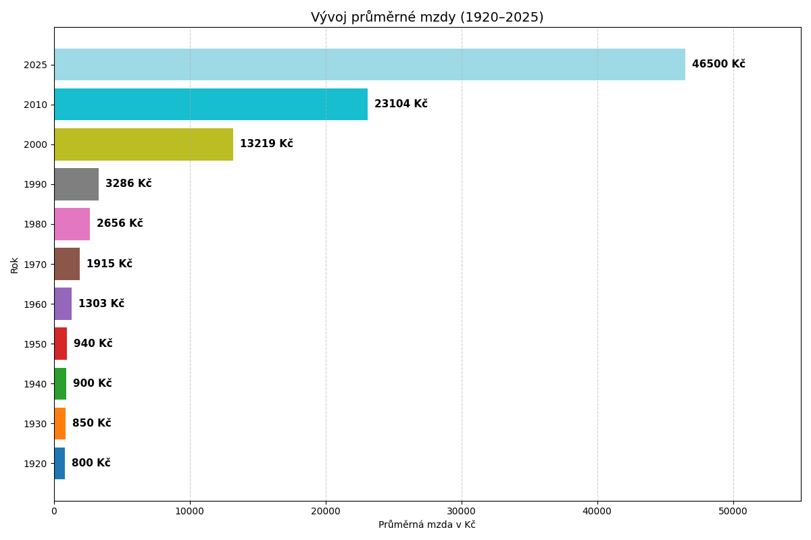
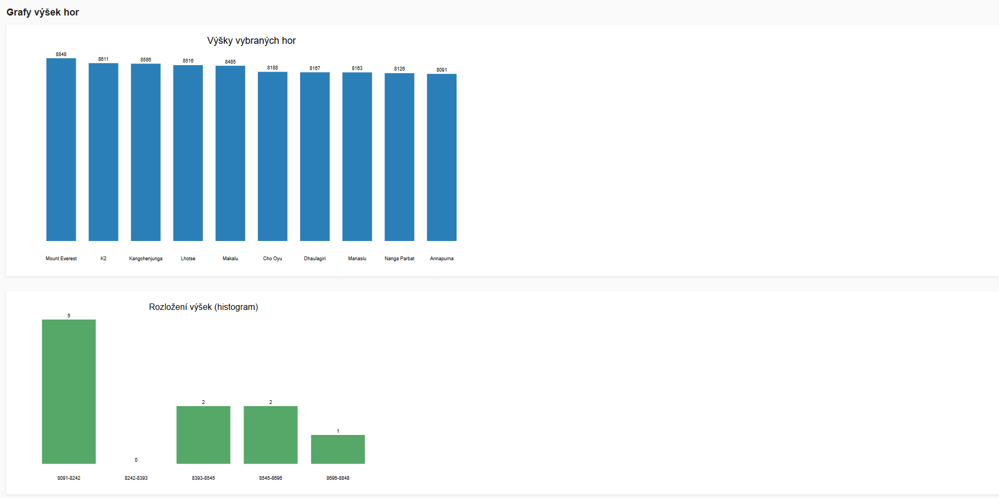
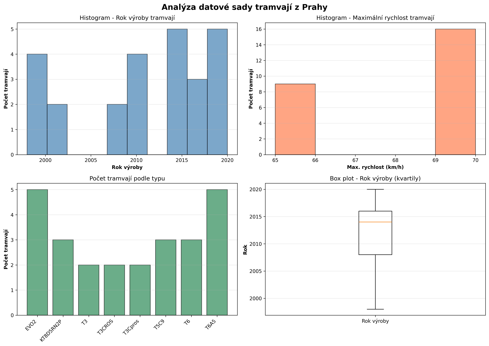

# 🎨 Zpracování dat

Ukázky zpracování zvoleného datového souboru.
Každý student má vlastní sekci se svým jménem, odkazem na GitHub
a náhledy obrázků uložených ve složce `images/`.

**Zadání**

S pomocí generativního AI chatbotu (Claude), GitHub Copilot, ChatGPT, Gemini ) vytvořte seznam s vnořeným seznamem, řetězcem nebo tuple, např. seznam tramvají z Prahy ve formátu: (typ, maximální_rychlost_km_h, rok_první_výroby) a databázi smysluplným způsobem zpracujte:

filtrování seznamu, řazení podle různých atributů, výpočet popisných statistik, grafická reprezentace - histogram.
Popište databázi se kterou jste pracovali a vložte histogram s krátkým komentářem. Ve dvou větách napište závěr vašeho průzkumu. 

Základy práce ze seznamy - sdílený soubor 

**Rychlá navigace:**  
[Balanets](#anastasiia-balanets) ·
[Bartuněk](#michael-bartuněk) ·
[Borovička](#ondřej-borovička) ·
[Brož](#adam-brož) ·
[Fenynets](#vitalii-fenynets) ·
[Filip](#tomáš-filip) ·
[Garčic](#vojtěch-garčic) ·
[Horáček](#daniel-horáček) ·
[Hron](#michal-hron) ·
[Jandák](#tomáš-jandák) ·
[Jiránek](#lukáš-jiránek) ·
[Kravets](#maksym-kravets) ·
[Kreperát](#šimon-kreperát) ·
[Kryvka](#karyna-kryvka) ·
[Kubala](#šimon-kubala) ·
[Kubát](#pavel-kubát) ·
[Mandziuk](#mykola-mandziuk) ·
[Mayrhofer](#hynek-mayrhofer) ·
[Miláček](#marek-miláček) ·
[Nahornyi](#mark-nahornyi) ·
[Pavelka](#dominik-pavelka) ·
[Povolný](#antonín-povolný) ·
[Procházka](#vincent-procházka) ·
[Řehák](#marek-řehák) ·
[Sauer](#matyáš-sauer) ·
[Suchánsky](#jakub-suchánsky) ·
[Sunkovský](#tomáš-sunkovský) ·
[Škarvan](#petr-škarvan) ·
[Štěpán](#tomáš-štěpán) ·
[Viták](#jáchym-viták)

---

## Anastasiia Balanets
🔗 https://github.com/qqqwwwaaarr/Balanets/blob/main/histogram.ipynb

---

## Michael Bartuněk
🔗 https://github.com/SkyGod934/Michael-Barunek

---

## Ondřej Borovička
🔗 https://github.com/dedeczech/Borovicka

Obrázek znázorňuje histogram využití tramvajových linek v Praze v procentech. Na vodorovné ose je uvedeno procentuální využití jednotlivých linek, zatímco svislá osa zobrazuje počet linek spadajících do daného intervalového rozsahu. Histogram je rozdělen do několika intervalů, které ukazují, jak často se jednotlivé hodnoty využití vyskytují. Z grafu je patrné rozložení vytíženosti tramvajových linek od méně využívaných až po nejvytíženější.

Z histogramu vyplývá, že většina tramvajových linek v Praze má střední až vyšší míru využití, přibližně mezi 50 % a 75 %. Menší část linek vykazuje nízké využití, zatímco jen několik linek dosahuje velmi vysoké vytíženosti nad 80 %. Tyto výsledky naznačují relativně rovnoměrné využití tramvajové dopravy, přičemž nejvytíženější linky mohou vyžadovat posílení kapacity nebo častější spoje.

---

## Adam Brož
🔗 https://github.com/Brozovec/broz

Popis práce a dosažené výsledky
Tento notebook provádí základní analýzu jednoduchého datasetu autobusů a demonstruje klíčové kroky při práci s daty pomocí knihoven pandas a matplotlib.

1. Import knihoven
V úvodu notebooku byly importovány potřebné knihovny: pandas pro práci s datovými rámci a matplotlib.pyplot pro vizualizaci dat.

2. Vytvoření datasetu
Byl vytvořen malý dataset obsahující informace o autobusech (typ, kapacita osob, rok první výroby). Tento dataset byl následně převeden do datového rámce df knihovny pandas, což umožnilo jeho snadnější manipulaci a analýzu. Zobrazením datového rámce jsme si ověřili jeho správné načtení a strukturu:

                 typ  kapacita  rok_vyroby
0        Karosa B732        95        1982
1        Karosa B952       100        2002
2           SOR NB12       105        2008
3           SOR NB18       160        2009
4  Solaris Urbino 12       110        2014
3. Filtrování dat
Data byla filtrována tak, aby zobrazovala pouze autobusy vyrobené po roce 2000. Tímto krokem jsme získali podmnožinu dat, která splňuje specifickou podmínku. Výsledek filtrace je následující:

                 typ  kapacita  rok_vyroby
1        Karosa B952       100        2002
2           SOR NB12       105        2008
3           SOR NB18       160        2009
4  Solaris Urbino 12       110        2014
4. Řazení dle kapacity
Dataset byl seřazen podle kapacity autobusů sestupně (od největší po nejmenší). To nám umožnilo rychle identifikovat autobusy s nejvyšší kapacitou. Seřazený datový rámec vypadá takto:

                 typ  kapacita  rok_vyroby
3           SOR NB18       160        2009
4  Solaris Urbino 12       110        2014
2           SOR NB12       105        2008
1        Karosa B952       100        2002
0        Karosa B732        95        1982
5. Vizualizace – histogram kapacit
Pro lepší pochopení distribuce kapacit autobusů byl vytvořen histogram. Tento graf vizuálně zobrazuje, jak často se jednotlivé rozsahy kapacit v datasetu vyskytují, a poskytuje rychlý přehled o rozložení dat.

Celkově notebook demonstruje základní operace s daty jako je vytváření, filtrování, řazení a vizualizace, které jsou klíčové pro jakoukoliv datovou analýzu.

)

---

## Vitalii Fenynets
🔗 https://github.com/Ekzarmfs/Fenynets.git

---

## Tomáš Filip
🔗 https://github.com/tomasfilip2009-ship-it/Tom-Filip

---

## Vojtěch Garčic
🔗 https://github.com/JouJoumanCZ/skola
Analýza dvanácti českých řek v Pythonu pomocí seznamu toulů ukázala průměrnou délku 232 km a průtokovou dominanci Labe. Histogram odhaluje, že většina toků měří 100–250 km, přičemž pouze tři hlavní tepny přesahují 300 km, což dokládá soustředění sítě do několika klíčových koryt. Závěrem lze říci, že česká říční síť sestává z mnoha středních přítoků napájejících pár hlavních tepen. Vodnatost toku přitom závisí více na ploše povodí než na jeho celkové délce.

---

## Daniel Horáček
🔗 https://github.com/Dndskid/Horacek

Vytváří barevný sloupcový histogram popularity filmových žánrů (Akční, Komedie, Drama, Horor, Sci-Fi, Romantické) od 1980s do 2020s s detailními statistikami.

---

## Michal Hron
🔗 https://github.com/michal670/Hron---repozit-

---

## Tomáš Jandák
🔗 https://github.com/Tjandak/Jandak

Vývoj maximální rychlosti tramvají v čase

Graf znázorňuje vztah mezi rokem výroby tramvají a jejich maximální konstrukční rychlostí. Je patrné, že s postupem času dochází k nárůstu maximálních rychlostí, což odráží technologický pokrok a modernizaci tramvajových vozů.

---

## Lukáš Jiránek
🔗 https://github.com/MentysTV/Jir-nek-Luk-

Tento graf zobrazuje porovnání nejvyšších budov světa.

---

## Maksym Kravets
🔗 https://github.com/Maomi0906/Kravets-Maksym

Graf ukazuje rozložení počtu filmů podle jejich hodnocení IMDb. Na vodorovné ose (Hodnocení IMDb) jsou uvedeny intervaly hodnocení od 8,5 do 9,3 bodu. Na svislé ose (Počet filmů) je uveden počet filmů v každém intervalu.

---

## Šimon Kreperát
🔗 https://github.com/Simanski7/Kreperat

---

## Karyna Kryvka
🔗 https://github.com/moonlight-898/Karina

---

## Šimon Kubala
🔗 https://github.com/S-1man/ZacatkyPythonu---Kubala
Název: Analýza největších měst světa podle počtu obyvatel

Zpracoval jsem data o deseti největších městech světa, která obsahují název města, počet obyvatel a kontinent. Data jsem analyzoval v jazyce Python ve VS Code.

Z analýzy vyplývá, že největším městem je Tokyo s 37,4 milionu obyvatel a nejmenším městem v datasetu je Karachi s 16,4 milionu obyvatel. Průměrný počet obyvatel města vychází na 22 950 000. Většina měst v datech se nachází v Asii, což ukazuje na vysokou koncentraci velkých měst na tomto kontinentu.

Histogram znázorňuje rozdělení měst podle počtu obyvatel. Je vidět, že většina měst má mezi 18 a 25 miliony obyvatel, zatímco Tokyo výrazně vyčnívá nad ostatními.

Na závěr lze říci, že data nejsou rovnoměrně rozložená a jeden extrémně velký údaj má výrazný vliv na celkový přehled, což histogram dobře ukazuje.

---

## Mykola Mandziuk
🔗 https://github.com/pepsikolya/stocks

Vizualizace Hustoty Zalidnění

Tento projekt je jednoduchý Python skript pro analýzu demografických dat. Jeho hlavním cílem je vypočítat hustotu zalidnění (počet obyvatel na km²) pro různé země světa a vizualizovat výsledky formou přehledného grafu.
---

## Hynek Mayrhofer
🔗 https://github.com/hynekmayrhofer1/Hynek-Mayrhofer
Histogram hodnocení vybraných filmů
Graf zpracovává hodnocení deseti vybraných filmů uložených v databázi (název filmu, rok vydání, hodnocení).
Zohledněna jsou číselná hodnocení filmů v rozmezí přibližně 8,6 až 9,3.

Jednotlivé sloupce ukazují, kolik filmů spadá do určitého intervalového pásma hodnocení.

Největší koncentrace filmů se nachází v rozmezí 8,7–8,9, což znamená, že většina filmů má velmi vysoké a podobné hodnocení.

Extrémní hodnoty (nejnižší a nejvyšší hodnocení) jsou zastoupeny menším počtem filmů.
Z grafu vyplývá, že:

Všechny analyzované filmy jsou nadprůměrně až výjimečně hodnocené

Hodnocení jsou málo rozptýlená, což potvrzuje vysokou kvalitu výběru filmů

Průměrné i mediánové hodnocení se pohybuje kolem 8,8, což odpovídá hlavnímu vrcholu histogramu

Celkově lze říci, že databáze obsahuje převážně kriticky oceňované a divácky oblíbené filmy.

---

## Marek Miláček
🔗 https://github.com/marek-milacek/MMilacek

# Popis práce a analýza letových dat

Tento skript provádí komplexní analýzu a vizualizaci syntetických dat týkajících se globální letecké dopravy. Cílem je demonstrovat pokročilé možnosti vizualizace pomocí knihovny `matplotlib` (včetně subplotů) a efektivní práci s daty v `pandas`.

### 1. Import knihoven a nastavení
V úvodu byly načteny klíčové knihovny pro datovou vědu:
* **pandas:** Pro manipulaci s daty a tvorbu DataFrame zlovníků.
* **matplotlib.pyplot:** Pro tvorbu pokročilých grafů a vizualizací.
* **numpy:** Pro generování náhodných dat a numerické operace.

Zároveň byl globálně nastaven styl grafů na `seaborn-v0_8-darkgrid` a definována výchozí velikost obrazců pro zajištění čitelnosti.

### 2. Generování a příprava dat
Data nebyla načítána z externího souboru, ale vytvořena programově pro účely demonstrace:
* **Dataset letišť:** Byl definován slovník `letisteData` obsahující metriky pro 10 světových letištích (např. Praha, Londýn, New York). Sledujeme počet letů, průměrnou délku letu a počet destinací. Data byla převedena na `pandas DataFrame`.
* **Kategorizace letů:** Definice typů letů (Domácí, Evropské, Transatlantické atd.) a jejich průměrných délek.
* **Časová řada:** Pomocí `numpy` byla vygenerována náhodná data o počtu letů pro každý měsíc v roce 2026.

### 3. Komplexní vizualizace (Dashboard)
Hlavním výstupem skriptu je **figura složená z 6 podgrafů (subplots)**, která poskytuje holistický pohled na data:

1.  **Počet letů na letištích (Sloupcový graf):** Zobrazuje vytížení jednotlivých letišť s využitím barevné škály `viridis` a popisky hodnot.
2.  **Průměrná délka letu (Horizontální pruhový graf):** Indikuje zaměření letiště (regionální vs. dálkové linky).
3.  **Vztah: Počet letů vs. Destinací (Scatter plot):** Bublinový graf zobrazující 4 dimenze dat: osu X (lety), osu Y (destinace), velikost bubliny a barvu (průměrná délka letu).
4.  **Distribuce typů letů (Koláčový graf):** Procentuální rozložení typů linek.
5.  **Měsíční trend (Spojnicový graf):** Vývoj počtu letů v roce 2026 s vyplněnou oblastí pod křivkou.
6.  **Variabilita délky letů (Box plot):** Statistický pohled na rozptyl délek letů v jednotlivých kategoriích (min, max, medián), kde data byla simulována normálním rozdělením.

### 4. Textový souhrn statistiky
Na závěr skript vypisuje do konzole přehlednou tabulku a agregované metriky:
* Celkový objem letů a destinací v síti.
* Identifikace nejrušnějšího letiště.
* Statistika průměrných délek letů.

Tento kód slouží jako ukázka tvorby profesionálního analytického dashboardu v Pythonu bez nutnosti použití externích BI nástrojů.

---

## Mark Nahornyi
🔗 https://github.com/MarkQTN/SPSD-Nahornyi

---

## Pavel Kubát
🔗 https://github.com/Piratesk1/Kubat

Histogram vlastností letadel

Graf zobrazuje dolet jednotlivých letadel v kilometrech. Je vidět, že Airbus A380 a Boeing 747 mají největší dolet, zatímco MiG-21 a Cessna 172 patří k letadlům s nejkratším doletem.

---

## Dominik Pavelka
🔗 https://github.com/dominikpavelka1515/Dominik-Pavelka/tree/main 
Analýza 20 autobusových linek v Praze pomocí Pythonu ukázala průměrnou délku 13.0 km a délkovou dominanci linky 177 (25.5 km). Histogram odhaluje, že většina tras měří 5–15 km, přičemž pouze 2 hlavní tepny přesahují 20 km, což dokládá soustředění sítě do několika páteřních spojů. Závěrem lze říci, že pražská síť v tomto vzorku sestává z mnoha kratších obslužných linek napájejících pár dlouhých tangenciálních tras. Počet zastávek přitom silně koreluje s celkovou délkou linky.

---

## Antonín Povolný
🔗 https://github.com/TondaPovolny/Povolny

Histogram hodnocení filmů z minulého století

Graf zobrazuje kolik filmů má stejné hodnoce a průměrné hodnocení. Je vidět že průměrné hodnocení je lehce po 9 body z 10.

---

## Vincent Procházka
🔗 https://github.com/VincentProchazka/Vincent-Prochazka

---

## Marek Řehák
🔗 https://github.com/MarekRehak/-eh-k.git

---

## Matyáš Sauer
🔗 https://github.com/MatyaSau/Sauer

---

## Petr Škarvan
🔗 https://github.com/Petr-Skarvan/skarvan.py

Historický vývoj mzdy v česku ukazuje na extrémní zrychlení růstu příjmů po roce 1990. Tento dramatický skok od stovek korun k desetitisícům odráží nejen ekonomickou transformaci země, ale i hluboké změny v kupní síle a cenové hladině.

---

## Tomáš Štěpán
🔗 https://github.com/Tomas120cz/Stepan

---

## Jakub Suchánsky
🔗 https://github.com/jakubsuchansky/Suchansky
Histogram Denních Teplot Během Roku

Histogram denních teplot během roku znázorňuje rozložení průměrných teplot za všech 365 dní. Z grafu je patrné několik vrcholů odpovídajících jednotlivým ročním obdobím – nejvíce dní se soustředí kolem jarních a podzimních teplot, zatímco extrémně nízké zimní a vysoké letní teploty se vyskytují méně často.

---

## Tomáš Sunkovský
🔗 https://github.com/TomyssCZ/Tomas-Sunkovsky

Závěr Průzkumu
Analýza pražských tramvají ukazuje, že Praha postupně modernizuje svůj vozový park - přibližně polovina vozů je mladší než 6 let a dosahuje vyšších rychlostí (70 km/h), zatímco starší modely z počátku 2000. let s nižší rychlostí (65 km/h) postupně stárnou. Přestože trend modernizace je pozitivní, vysoká variabilita stáří vozů (rozpětí 22 let) indikuje, že Praha bude muset v následujících letech pokračovat v intenzivní aktualizaci vozového parku, aby zajistila bezpečnost, komfort cestujících a dlouhodobou efektivitu provozu tramvajové dopravy.

---

## Jáchym Viták
🔗 https://github.com/Jachy47/Vitak2

Graf znázorňuje porovnání cen různých SSD a HDD disků v českých korunách.
Je vidět, že SSD disky jsou obecně dražší než HDD při stejné nebo podobné kapacitě.
Nejlevnější variantou v grafu je HDD 2TB s 7200 otáčkami, který stojí přibližně 980 Kč.
Naopak nejdražší položkou je SSD 1TB s cenou okolo 1900 Kč.
SSD 1TB NVMe je o něco levnější než klasické SSD 1TB, ale stále výrazně dražší než HDD disky.
HDD 1TB a HDD 2TB mají poměrně podobné ceny, přestože se liší kapacitou.
Celkově graf ukazuje, že vyšší rychlost a modernější technologie u SSD disků se odráží ve vyšší ceně.
---

🗳️ **Hlasování:**  
Použijte reakce (👍 ❤️ 🚀) u obrázků nebo mentimeter 23. 1..
